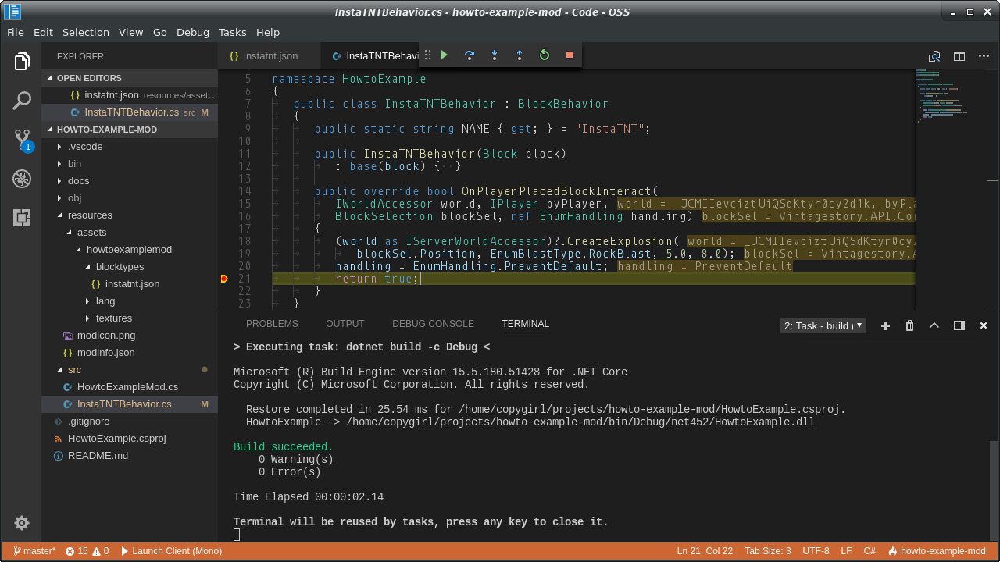
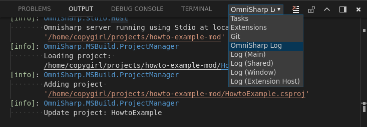
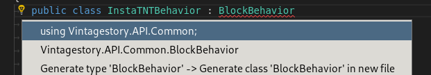
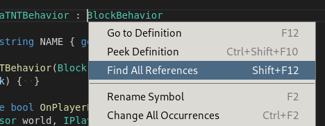

# How to set up Vintage Story modding with VS Code and .NET tools

This repository will attempt to explain and demonstrate how to set up a modding enviroment for the creation of mods for the block-based sandbox game [Vintage Story][VS] using the [.NET SDK][dotnet] and [VS Code][vscode].



This how-to was last updated for Vintage Story version 1.15 but will hopefully continue working in the future.

## Why .NET 5?

Vintage Story is built against .NET Framework 4.6.1 and runs using Mono on platforms other than Windows. Why are we using .NET 5?

- It's **cross-platform**. With .NET 5, the successor of .NET Core, we don't need to change our tooling or commands to work on different platforms. I've moved from Windows to Linux while working on Vintage Story mods and only needed to make minor changes to also make it work on another platform.
- It's **convenient**. As the .NET SDK comes with the `dotnet` command to manipulate, create and build project and solution files, we don't need to rely on IDEs. The newer `.csproj` file format doesn't require referencing every single `.cs` file, either.

## Why Visual Studio Code?

Despite what its name might imply, this has nothing to do with the arguably overblown IDE that is Visual Studio. It's a relatively light-weight, cross-platform code editor that comes with syntax highlighting, code completion, source control integration, debugging tools, ...

Essentially you get most of the IDE features you're used without any of the bloat, in a modern look.

## Prerequisites

- Get the [game][VS].
- Install the [.NET SDK][dotnet-dl].
- Install [Visual Studio Code][vscode-dl].
- Install the [C# extension][cs-ext] from the "Extensions" tab in VS Code.
- If you run on Mono, install the [Mono Debug][mono-ext] extension.

If you're on Arch Linux like me, you can get the game using the [AUR][AUR] package [`vintagestory`][VS-AUR] (created by me), and the .NET SDK and VS Code by installing the official packages `dotnet-sdk` and `code`.

### Environment Variables

I also recommend setting up two environmental variables, however only the former is required for this setup to work.

- `VINTAGE_STORY`, which points to the where the game is installed.
- `VINTAGE_STORY_DATA`, pointing to the user data directory.

Since I'm on Linux, I just add the following lines to my `~/.xprofile` (which takes effect after a restart). Of course, you have to adjust this depending on where you have installed the game.

```sh
export VINTAGE_STORY=/usr/share/vintagestory
export VINTAGE_STORY_DATA=$HOME/.config/VintagestoryData
```

If you're on another operating system, I suggest you search online how to set environment variables, as it's not straight forward. On Windows, the paths can be set to be `%AppData%\Vintagestory` and `%AppData%\VintagestoryData`.

This will just make things more consistent across different platforms and setups, and it's what I will use in this repository and how-to, but it's not required. However, if you decide to leave this out, do make sure to update any occurances in the `.csproj` and `launch.json` with absolute paths.

## Project Setup

Now that we're done with that, it's time to set up the project structure. Create and open a new folder in VS Code!

OmniSharp gets a bit confused with Mono so if you see the following error, open your user or workspace settings (press `F1` and search for "user / workspace settings") and set "Omnisharp: Use Global Mono" to "always".

> The reference assemblies for .NETFramework,Version=v4.6.1 were not found. To resolve this, install the Developer Pack (SDK/Targeting Pack) for this framework version or retarget your application.

### Directory Structure

- `./`: The root folder is mainly where our `.csproj` file will reside, but other files are going to end up here, such as `.gitignore` if you're using Git, the readme, license, ...
- `./src/`: Contains all source (`.cs`) files for our mod. This is what makes this a code mod over a simple content mod, which just contains assets. More on this destinction on the [official wiki][VS-wiki].
- `./resources/`: This directory contains all files which will eventually be included in the release `.zip` file such as the `modinfo.json`.
- `./resources/assets/`: Contains all assets for our mod. Unlike some other games (*cough* Minecraft *cough*), a lot of the heavy lifting will already be done by the asset loading portion of the engine.

### Project File

Copy the [`.csproj`](HowtoExample.csproj) from this repository into your project folder, and rename it. It contains the minimum requirements for the project to build and a release to be created.

As for example seen in [CarryCapacity's project file][carrycapacity-csproj], there are more fields you can include for the sake of completion, but these are not strictly required.

#### References

```xml
<Reference Include="VintagestoryAPI">
  <HintPath>$(VINTAGE_STORY)/VintagestoryAPI.dll</HintPath>
  <Private>false</Private>
</Reference>
```

Here, we're adding a reference to the modding API `.dll`. In [the example's .csproj](HowtoExample.csproj) you can see some additional commented-out references, which you can use to include the official base mods (essentials, survival and creative) if your code needs them.

Setting `<Private>false</Private>` means that this `.dll` will not be copied to the output folder, as we don't want them to be included in our releases.

#### Releases

```xml
<ItemGroup Condition="'$(Configuration)' == 'Release'">
  <None Include="UNLICENSE" CopyToOutputDirectory="PreserveNewest" />
  <None Include="resources/**">
    <Link>%(RecursiveDir)%(Filename)%(Extension)</Link>
    <CopyToOutputDirectory>PreserveNewest</CopyToOutputDirectory>
  </None>
</ItemGroup>
```

This causes additional files to be included in the output folder (`bin/debug/net461/`) when building the project in release configuration. As you can see, you can use this to include a license file as well - remove or change this as needed for your own project. Then, we also want to include the contents of the `resources` folder.

```xml
<Target Name="Package" AfterTargets="PostBuildEvent" Condition="'$(Configuration)' == 'Release'">
  <ZipDirectory DestinationFile="bin/$(TargetName).zip" SourceDirectory="$(TargetDir)" Overwrite="true" />
</Target>
```

This packs all the files in the output folder into a single `.zip` file for you to release.

To build the mod in release configuration, run `dotnet build -c Release` or the "Build (Release)" task that I show you how to set up further below.

### General VS Code suggestions and Cheat Sheet

At this point you have everything set up to start writing some code, so here are some basic things to get you set up.

First of all, one of the issues you might encounter is code completion not working properly. This is likely because you have created the project after
the C# extension has started up. To fix that, press `F1` to open the **Command Palette** and enter "Reload Window".

This time OmniSharp should recognize the project, and you can open the "Output" window to verify this. There's a lot of ways to get to it, including the command palette (search for "Toggle Output" this time), just make sure you have "OmniSharp Log" selected in the dropdown:



Next up, if you already know the type names you want to use, but not which namespace they're residing in, or you don't want to bother manually importing them, simply write the type name and pay attention to the **Quick Fix** bulb to the left, which you can either click or press `Ctrl+.`to get to:



Also, on a right click you have the option of **Go to Definiton** (`F12`) and **Rename Symbol** (`F2`) which are two other things I end up using a lot. The former can also be used to see which methods are available on an API type to which you don't have source access to.



## Tasks and Launchers

After you've gotten familiar with some resources on how to create your mod, either from looking at the [Vintage Story Wiki][VS-wiki] or taking inspiration from other open source mods, it is time to actually build and launch it in the game.

For this we need two things: First, a `.vscode/tasks.json` file, in which we'll define a build task to compile our mod into a handy `.dll` file. The compilation step **can** be done by the game itself, which is explained on the wiki, but you lose out on the possibility of debbugging your code.

```json
{
  "version": "2.0.0",
  "tasks": [{
    "label": "Build (Debug)",
    "group": { "kind": "build", "isDefault": true },
    "presentation": { "reveal": "silent" },
    "problemMatcher": "$msCompile",
    
    "type": "process",
    "command": "dotnet",
    "args": [ "build", "-c", "Debug" ]
  },{
    "label": "Build (Release)",
    "group": "build",
    "presentation": { "reveal": "silent" },
    "problemMatcher": "$msCompile",
    
    "type": "process",
    "command": "dotnet",
    "args": [ "build", "-c", "Release" ]
  }]
}

```

The default `build` task can be run by pressing `Ctrl+Shift+B`. Other tasks may be run by pressing `F1` and typing "Run Task".

To run the game and make it load our new mod, we'll create a **launcher**. This way, we can also hook the debugger into the game, allowing us to use breakpoints and debug exceptions originating from our code.

```json
{
  "version": "0.2.0",
  "configurations": [{
    "name": "Launch Client",
    "type": "mono",
    "request": "launch",
    "preLaunchTask": "Build (Debug)",
    "program": "${env:VINTAGE_STORY}/Vintagestory.exe",
    "args": [
      "--playStyle" , "preset-surviveandbuild",
      "--openWorld" , "modding test world",
      "--addModPath", "${workspaceFolder}/bin/Debug/net461",
      "--addOrigin" , "${workspaceFolder}/resources/assets",
    ],
    "console": "internalConsole",
    "internalConsoleOptions": "openOnSessionStart",
  }]
}

```

Note that if you're using **.NET on Windows**, you need to replace `type` with `"clr"`. In this project's [launch.json](.vscode/launch.json) you'll find that I've created two launchers: One for .NET, and one for Mono. You may choose to do this as well to ensure your project can be run from multiple plaforms.

These are the arguments we're passing to the game:

- `--playStyle`: The world configuration preset. Only used if it doesn't exist yet.  
  `preset-surviveandbuild` = normal / survival. `creativebuilding` = superflat / creative.
- `--openWorld`: Open or create a world with the specified name.
- `--addModPath`: Additional paths that the game will search for mods from.
- `--addOrigin`: Load assets from one or multiple directories.

You should now be able to run the game in debug mode with your mod by simply selecting the appropriate launcher by pressing on "Launch Client" to the left of the bottom status bar in VS Code. When you've done this once, you can also run the last used launcher by pressing `F5`.


[VS]: https://www.vintagestory.at/
[VS-wiki]: http://wiki.vintagestory.at/
[VS-AUR]: https://aur.archlinux.org/packages/vintagestory
[dotnet]: https://dotnet.microsoft.com/
[dotnet-dl]: https://dotnet.microsoft.com/download
[vscode]: https://code.visualstudio.com/
[vscode-dl]: https://code.visualstudio.com/Download
[cs-ext]: https://marketplace.visualstudio.com/items?itemName=ms-vscode.csharp
[mono-ext]: https://marketplace.visualstudio.com/items?itemName=ms-vscode.mono-debug
[AUR]: https://wiki.archlinux.org/index.php/Arch_User_Repository
[carrycapacity-csproj]: https://github.com/copygirl/CarryCapacity/blob/master/CarryCapacity.csproj
[VSMods-github]: https://github.com/copygirl/VintageStoryMods
